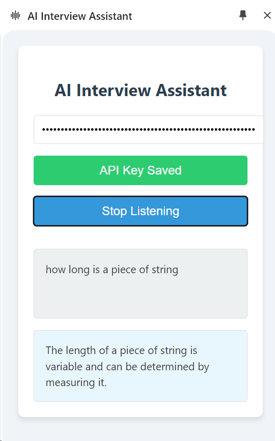

# AI Interview Assistant Chrome Extension v2.0

## Overview

The AI Interview Assistant is an advanced Chrome extension designed to help users during interviews or meetings by providing real-time AI-powered responses to questions. It features multiple AI providers, professional transcript storage, context-aware responses, and comprehensive interview preparation tools.

<div align="center">
	
</div>

## ✨ New Features in v2.0

### 🎯 Multiple AI Providers
- **OpenAI GPT-3.5/4**: Industry-leading language model
- **Google Gemini**: Google's latest AI model with competitive performance
- Easy switching between providers based on your preference and API availability

### 🎙️ Advanced Transcription
- **AssemblyAI Integration**: Professional-grade speech-to-text with high accuracy
- **Web Speech API Fallback**: Built-in browser speech recognition as backup
- Real-time transcription with interim results
- Enhanced question detection algorithms

### 📄 Context-Aware Responses
- **Job Description Upload**: Provide job posting details for relevant responses
- **Resume/CV Integration**: Upload your background for personalized answers
- **Intelligent Context Matching**: AI responses tailored to the specific role and your experience

### 💾 Professional Storage
- **Netlify Backend**: Secure cloud storage for all transcripts
- **MongoDB Integration**: Reliable database for transcript history
- **Local & Cloud Sync**: Automatic backup of interview sessions
- **Export Capabilities**: Download transcripts for review and analysis

### 🎨 Enhanced User Interface
- Modern, intuitive design with improved usability
- Real-time status indicators and error handling
- Comprehensive transcript history with timestamps
- Responsive design for various screen sizes

## Installation

### Prerequisites

- Google Chrome browser (version 114 or later)
- API keys for your chosen services:
  - **OpenAI API Key** (for GPT responses)
  - **Google Gemini API Key** (alternative AI provider)
  - **AssemblyAI API Key** (for professional transcription)

### Steps

1. **Clone the Repository**
   ```bash
   git clone https://github.com/your-username/ai-interview-assistant.git
   cd ai-interview-assistant
   ```

2. **Install Chrome Extension**
   - Open Google Chrome and navigate to `chrome://extensions/`
   - Enable "Developer mode" in the top right corner
   - Click "Load unpacked" and select the extension directory
   - The AI Interview Assistant should appear in your extensions list

3. **Set Up Backend (Optional but Recommended)**
   ```bash
   # Install dependencies
   npm install
   
   # Deploy to Netlify
   npm run deploy
   ```

4. **Configure API Keys**
   - Click the extension icon to open the side panel
   - Select your preferred AI provider
   - Enter your API keys in the respective fields
   - Save each key - they're stored securely in Chrome's sync storage

## 🚀 Quick Start Guide

### Basic Setup
1. **Choose AI Provider**: Select OpenAI or Google Gemini from the dropdown
2. **Add API Keys**: Enter your API keys for the chosen provider and AssemblyAI
3. **Upload Context**: Add your resume and job description for better responses

### Using the Extension
1. **Start Interview Session**: Click "Start Listening" to begin audio capture
2. **Real-time Assistance**: Questions are automatically detected and answered
3. **Save Transcripts**: Use "Save Transcript" to store important sessions
4. **Review History**: Access past transcripts in the history section

## 🔧 Configuration

### AI Provider Setup

#### OpenAI
1. Get API key from [OpenAI Platform](https://platform.openai.com/api-keys)
2. Ensure you have sufficient credits
3. Recommended for general interview questions

#### Google Gemini
1. Get API key from [Google AI Studio](https://makersuite.google.com/app/apikey)
2. Enable the Gemini API in Google Cloud Console
3. Great alternative with competitive performance

#### AssemblyAI
1. Sign up at [AssemblyAI](https://www.assemblyai.com/)
2. Get your API key from the dashboard
3. Provides superior transcription accuracy

### Backend Configuration

#### Netlify Setup
1. **Create Netlify Account**: Sign up at [netlify.com](https://netlify.com)
2. **Deploy Functions**: 
   ```bash
   # Install Netlify CLI
   npm install -g netlify-cli
   
   # Login to Netlify
   netlify login
   
   # Deploy your functions
   netlify deploy --prod
   ```
3. **Set Environment Variables**:
   - `MONGODB_URI`: Your MongoDB connection string
   - Add these in Netlify dashboard under Site Settings → Environment Variables

#### MongoDB Setup
1. **Create MongoDB Atlas Account**: Sign up at [mongodb.com](https://www.mongodb.com/cloud/atlas)
2. **Create Cluster**: Set up a free cluster
3. **Get Connection String**: Copy the connection URI
4. **Add to Netlify**: Set as `MONGODB_URI` environment variable

## 📖 Usage Guide

### Interview Preparation
1. **Upload Job Description**: Paste or upload the job posting
2. **Add Resume**: Include your CV for personalized responses
3. **Save Context**: Click "Save Context" to store this information

### During Interviews
1. **Start Listening**: Begin audio capture before the interview starts
2. **Monitor Transcript**: Watch real-time transcription in the transcript area
3. **Review AI Responses**: Check suggested answers in the AI response section
4. **Save Important Sessions**: Use "Save Transcript" for sessions you want to keep

### Post-Interview
1. **Review Transcripts**: Check the history section for past sessions
2. **Export Data**: Download transcripts for analysis
3. **Improve Responses**: Update your context based on interview feedback

## 🔒 Privacy and Security

### Data Protection
- **Local Storage**: API keys stored securely in Chrome's encrypted storage
- **Secure Transmission**: All API calls use HTTPS encryption
- **No Audio Storage**: Audio is processed in real-time, not stored permanently
- **User Control**: You control what context information to provide

### GDPR Compliance
- **Data Minimization**: Only necessary data is collected
- **User Consent**: Explicit permission required for all data processing
- **Right to Deletion**: Clear transcript history anytime
- **Transparency**: Full visibility into what data is stored and how

## 🛠️ Troubleshooting

### Common Issues

#### Audio Capture Problems
- **Permission Denied**: Ensure microphone access is granted
- **No Audio Detected**: Check system audio settings
- **Poor Quality**: Try adjusting microphone sensitivity

#### API Issues
- **Invalid API Key**: Verify keys are entered correctly
- **Rate Limits**: Check your API usage quotas
- **Network Errors**: Ensure stable internet connection

#### Transcription Issues
- **Inaccurate Results**: Try speaking more clearly or closer to microphone
- **Missing Questions**: Check question detection sensitivity settings
- **Delayed Responses**: Verify API key validity and network speed

### Error Messages
- **"API key not set"**: Enter valid API key for selected provider
- **"Could not capture audio"**: Grant microphone permissions
- **"Transcription failed"**: Check AssemblyAI API key and credits
- **"Backend save failed"**: Verify Netlify function deployment

## 🔄 Updates and Maintenance

### Keeping Current
- **Extension Updates**: Chrome will auto-update when new versions are available
- **API Changes**: Monitor provider documentation for API updates
- **Security Patches**: Regularly update dependencies

### Backup and Recovery
- **Export Transcripts**: Regularly download important sessions
- **API Key Backup**: Keep secure copies of your API keys
- **Context Backup**: Save your job descriptions and resume externally

## 🤝 Contributing

We welcome contributions! Please see our [Contributing Guidelines](CONTRIBUTING.md) for details.

### Development Setup
```bash
# Clone the repository
git clone https://github.com/your-username/ai-interview-assistant.git

# Install dependencies
npm install

# Start development server
npm run dev
```

### Testing
- Test all AI providers with valid API keys
- Verify audio capture on different systems
- Check responsive design on various screen sizes

## 📄 License

This project is licensed under the MIT License - see the [LICENSE](LICENSE) file for details.

## 🙏 Acknowledgments

- **OpenAI** for GPT API access
- **Google** for Gemini API
- **AssemblyAI** for professional transcription services
- **Netlify** for serverless function hosting
- **MongoDB** for reliable data storage

## 📞 Support

For support, please:
1. Check the troubleshooting section above
2. Search existing [GitHub Issues](https://github.com/your-username/ai-interview-assistant/issues)
3. Create a new issue with detailed information
4. Join our [Discord Community](https://discord.gg/your-server) for real-time help

## 🚨 Disclaimer

This extension is designed as an interview preparation and assistance tool. Please ensure compliance with your organization's policies and interview guidelines. The developers are not responsible for any consequences arising from the use of this tool during actual interviews.

**Note**: This extension is not affiliated with or endorsed by OpenAI, Google, or AssemblyAI. Use of their APIs is subject to their respective terms of service and pricing.
